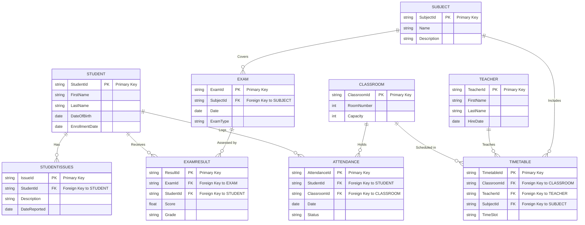

# Technical Assignment: School Management System

## Objective

Develop a comprehensive School Management System using ASP.NET Core and Entity Framework Core. The system will handle various aspects of school operations, including student management, teacher assignments, class scheduling, and examination processing.

### Database Model

Below are the entities required:

#### Students

- `StudentId`: Primary Key
- `FirstName`
- `LastName`
- `DateOfBirth`
- `EnrollmentDate`

#### Teachers

- `TeacherId`: Primary Key
- `FirstName`
- `LastName`
- `HireDate`

#### Classrooms

- `ClassroomId`: Primary Key
- `RoomNumber`
- `Capacity`

#### Attendance

- `AttendanceId`: Primary Key
- `StudentId`: Foreign Key to Students
- `ClassroomId`: Foreign Key to Classrooms
- `Date`
- `Status`: (Present, Absent, Excused)

#### Timetable

- `TimetableId`: Primary Key
- `ClassroomId`: Foreign Key to Classrooms
- `TeacherId`: Foreign Key to Teachers
- `SubjectId`: Foreign Key to Subject
- `TimeSlot`

#### StudentIssues

- `IssueId`: Primary Key
- `StudentId`: Foreign Key to Students
- `Description`
- `DateReported`

#### Subject

- `SubjectId`: Primary Key
- `Name`
- `Description`

#### Exam

- `ExamId`: Primary Key
- `SubjectId`: Foreign Key to Subject
- `Date`
- `ExamType`

#### ExamResult

- `ResultId`: Primary Key
- `ExamId`: Foreign Key to Exam
- `StudentId`: Foreign Key to Students
- `Score`
- `Grade`

### Diagram

### Functionality

- Complete CRUD operations for all entities.
- Functionality to assign students to classes and teachers to classrooms.
- Manage attendance for each class session.
- Schedule management for classes.
- Manage student issues and track resolutions.
- Handle examinations and posting of results.

### API Endpoints

- Endpoints for CRUD operations on all entities.
- Specific endpoints for managing classroom assignments, attendance tracking, timetable management, issue tracking, and exam results.

### Documentation

- API documentation using Swagger or a similar tool.

## Evaluation Criteria

- **Code Quality**: Clarity, maintainability, and adherence to best practices.
- **Database Design**: Effective use of relationships, data integrity, and performance considerations.
- **Functionality**: All specified requirements should be fully implemented.

## Bonus Tasks (Optional, +10 points each)

- Clean Architecture Implementation

- Organize solution into layers:

* Domain → Entities, core logic
* Application → Interfaces, DTOs, services, MediatR (optional)
* Infrastructure → EF Core DbContext, persistence
* Web/API → Controllers, dependency injection
* Ensure Application layer does not depend on Infrastructure layer.

- Automatic Migration
- Ensure database is created and updated automatically when the application runs.
- Use Generic Response

## Submission Guidelines

- Submit the project via a Git repository.
