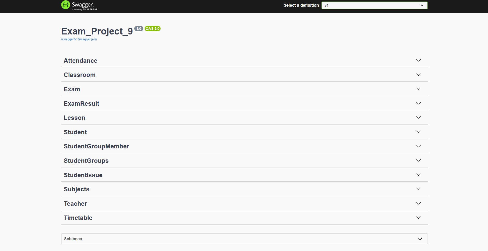

# 🎓 School Management System

A comprehensive School Management System built with ASP.NET Core and Entity Framework Core, designed to handle all aspects of school operations including student management, teacher assignments, class scheduling, attendance tracking, issue management, and examination processing. 🚀

## ✨ Features

* ✅ CRUD operations for all entities: Students, Teachers, Classrooms, Student Groups, Student Group Members, Subjects, Lessons, Timetables, Exams, Exam Results, and Student Issues.
* 👩‍🏫 Assign students to groups and teachers to classrooms. 
* 📝 Manage attendance for each class session. 
* 📅 Schedule management with timetables. 
* ⚠️ Track student issues and their resolutions. 
* 🏆 Handle examinations and post results. 
* 🏗️ Fully layered Clean Architecture:
* Domain: Entities and core logic. 
* Application: Services, DTOs, interfaces. 
* Infrastructure: EF Core DbContext and repositories. 
* Web/API: Controllers and dependency injection. 
* 🔄 Automatic database migration on application startup. 
* 📦 Generic API response wrapper for consistent responses. 
* 📖 API documentation using Swagger. 
* 🛠️ Technologies 
* ASP.NET Core 8 
* Entity Framework Core 8 
* PostgreSQL (or any relational DB)
* Swagger for API documentation

------
## 🗂️ Project Structure
```
/Clean.Domain        → Entities, core models
/Clean.Application   → DTOs, interfaces, services
/Clean.Infrastructure→ DbContext, repositories, configurations
/Web/API             → Controllers, API endpoints, middlewares
```
----

## 🚀 Getting Started
1. **Clone the repository:**

```
git clone <repo-url>

```

2. **Configure your appsettings.json with your database connection string. 🔧**


3. **Run the application:**
```
dotnet run
```

4. **The database will be automatically created and migrated. ✨**

5. **Access the API documentation via Swagger:**

```
http://localhost:<port>/swagger
```

---

## 📌 API Endpoints Overview

* `/Students` → Manage students 👨‍🎓
* `/Teachers` → Manage teachers 👩‍🏫 
* `/Classrooms` → Manage classrooms 🏫
* `/StudentGroups` → Manage student groups 🧑‍🤝‍🧑 
* `/StudentGroupMembers` → Assign/remove students from groups 🔗 
* `/Subjects` → Manage subjects 📚 
* `/Lessons` → Manage lessons 🏫
* `/Timetables` → Manage class schedules ⏰
* `/Exams` → Manage exams 📝
* `/ExamResults` → Post and manage exam results 🏆
* `/StudentIssues` → Track student issues ⚠️

**Each endpoint supports standard CRUD operations (GET, POST, PUT, DELETE) with optional extra endpoints for relationships and assignments.**

----

## 📝 Notes

All operations return a generic Response<T> object for consistency.

Student-Group-Teacher relationships are maintained via dedicated endpoints to prevent direct modifications that could break integrity.

Clean Architecture ensures the Application layer does not depend on Infrastructure, promoting maintainability and testability. 💡

----

## ✨ API Screenshot

----

## 📜 License
This project is open source and available under the MIT License.